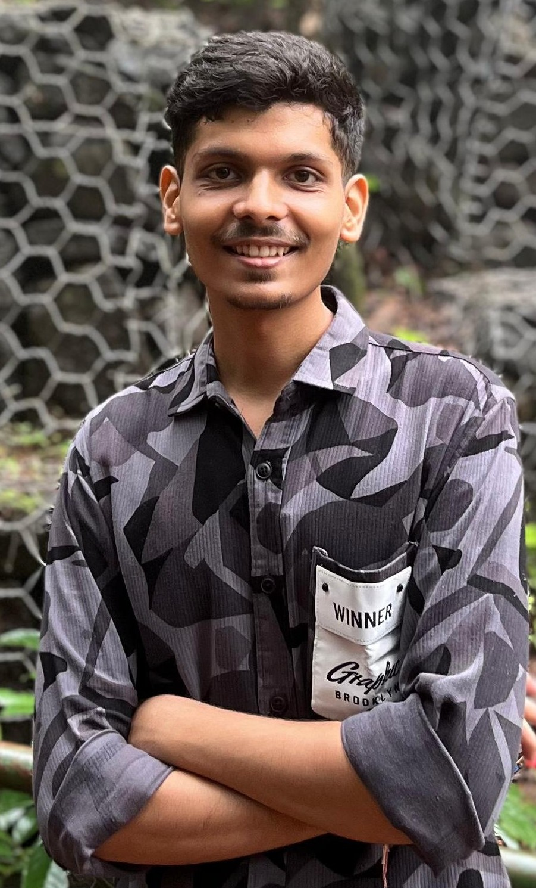

 

<!--
    Your own Terminal GIF can be created here -> https://www.terminalgif.com
-->

    

<!--
     My mission, because I'm a superhero!
-->
<!--
     This is the list of my skills and tools I am studying!
-->
### Main skills
## Languages

## Frameworks

## Tools and Technologies

## Database

## Deployment

### Studying

<!--
     I also have my own blog with useful information, check it out ^^
-->

<!--
Check out my latest post 👇  

     Fast links to my socials!
-->

### Connect with me!

    
    
    
    
    

<!--
     Oh, hello there, recruiters!
-->

### Employer?
> [!IMPORTANT]  
> <a href="./resume.pdf" download>Download my resume</a>

<!--
     Thanks for being my guest <3
-->
